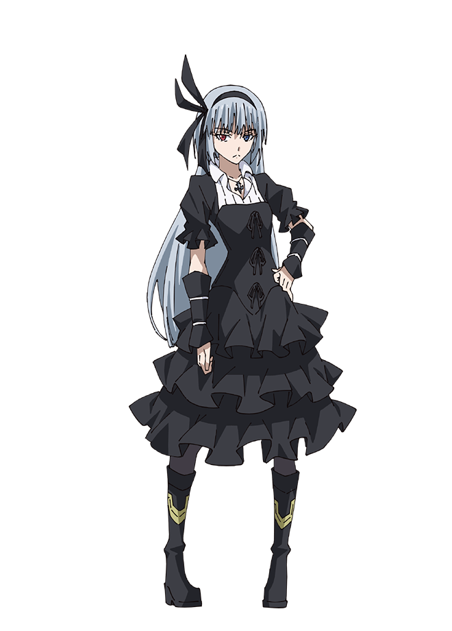

# VAL Bloopers

Below are a bunch of quotes, thoughts, experiences, and other random instances that occurred while working on this project.

---

### Version 0

* Yes.. this entire project is a reference for Tensura and the character Luminous Valentine. Take that JoJo fans!

* ASTs are super cool, definitely recommend checking them out[^1]. 🌳
* Coding ASTs in Python... "Circular Import Error"[^2] 💀
* C++ is giving me a headache. You're telling me I need to understand pointers and manage my own memory.. OH NAH 😭
* > "C++ grows into a dill pickle. Python smells dill pickle and munches on it. Python s**ts out C++ results[^3]." 
\- dev.slife 🐍

> [!NOTE]
> Originally VAL was coded in Python, however dev.slife decided to expand his knowledge and learn C++ to create a well structured math compiler (VAST) and have much more control over the code.

> [!NOTE]
> None of the source code for VAST is publicly available. The library is instead compiled and automatically pushed to the repo after it receives an update.

[^1]: An AST or [Abstract Syntax Tree](https://en.wikipedia.org/wiki/Abstract_syntax_tree) is a popular data structure used to help parse and represent text, or math equations in this case.

[^2]: While trying to code a custom AST in Python, dev.slife often ran into many issues when importing scripts. This was one of the main reasons he chose to switch from using Python to C++.

[^3]: This quote is referring to the process of how the web app communicates with VAST. The server opens a Python process which uses [CTYPES](https://docs.python.org/3/library/ctypes.html) and a `.dll` file to solve math equations. The DLL was replaced with a `.so` file shortly after for Linux compatability.

### Version 1

* > I was asked about why I started and continue to work on this project. The answer is simple.. because I enjoy it.
\- dev.slife 🌠
* Docker is truly one of the best whales out there. 🐳

*-- more to be added later (need to dig through my notes lol) --*